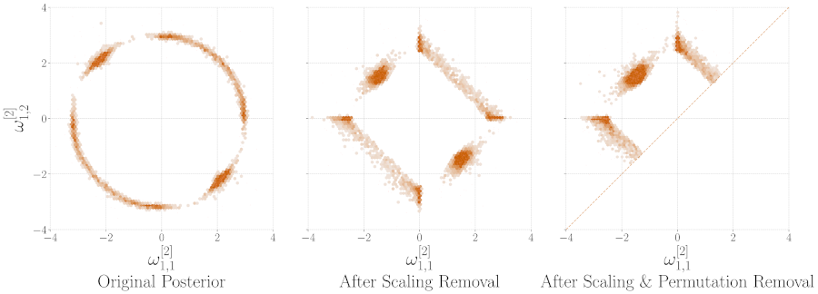

*This website contains information regarding the paper A Symmetry-Aware Exploration of Bayesian Neural Network Posteriors.*

> **TL;DR**: We explore the Bayesian posterior of modern deep neural networks, highlighting the impact of weight-space symmetries.

Please cite our work if you find it useful:

```bibtex
@inproceedings{laurent2024symmetry,
  title={A symmetry-aware exploration of bayesian neural network posteriors},
  author={Laurent, Olivier and Aldea, Emanuel and Franchi, Gianni},
  booktitle={ICLR},
  year={2024}
}
```



# Abstract

The distribution of modern deep neural networks (DNNs) weights -- crucial for uncertainty quantification and robustness -- is an eminently complex object due to its extremely high dimensionality. This paper presents one of the first large-scale explorations of the posterior distribution of deep Bayesian Neural Networks (BNNs), expanding its study to real-world vision tasks and architectures. Specifically, we investigate the optimal approach for approximating the posterior, analyze the connection between posterior quality and uncertainty quantification, delve into the impact of modes on the posterior, and explore methods for visualizing the posterior. Moreover, we uncover weight-space symmetries as a critical aspect for understanding the posterior. To this extent, we develop an in-depth assessment of the impact of both permutation and scaling symmetries that tend to obfuscate the Bayesian posterior. While the first type of transformation is known for duplicating modes, we explore the relationship between the latter and L2 regularization, challenging previous misconceptions. Finally, to help the community improve our understanding of the Bayesian posterior, we release the <a href="https://huggingface.co/datasets/torch-uncertainty/Checkpoints">first large-scale checkpoint dataset</a>, including thousands of real-world models, along with our <a href="https://github.com/ENSTA-U2IS-AI/torch-uncertainty">code</a>.

# Code & Dataset

The code consists of a library for training and evaluating the models - TorchUncertainty, a dataset available for download on <a href="https://huggingface.co/datasets/torch-uncertainty/Checkpoints">Hugging Face</a> and specific code that will be made available in <a href=" https://github.com/o-laurent/Symmetries-BNN-Posteriors">this repository</a>.
